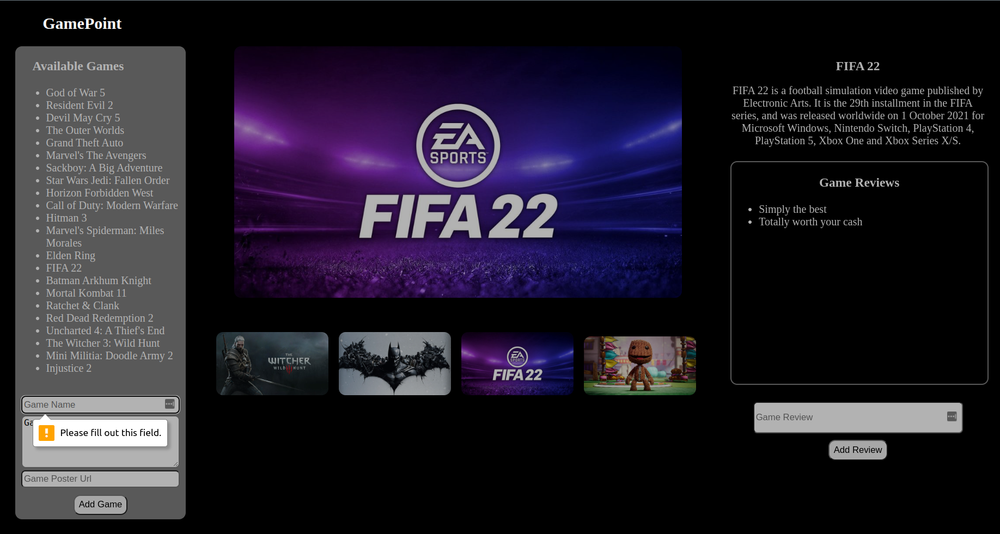
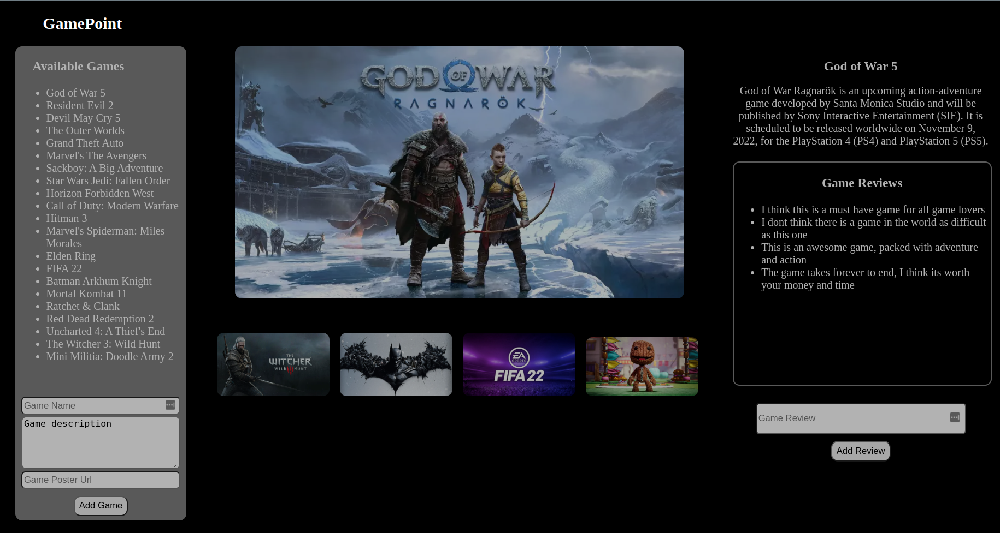
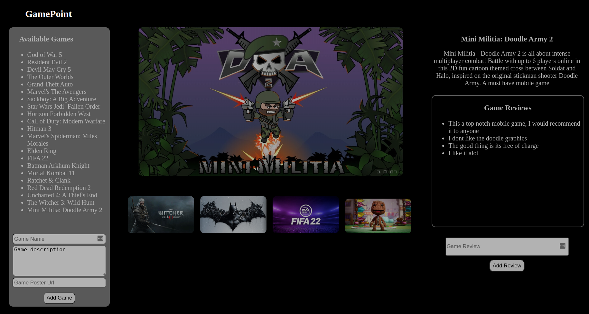
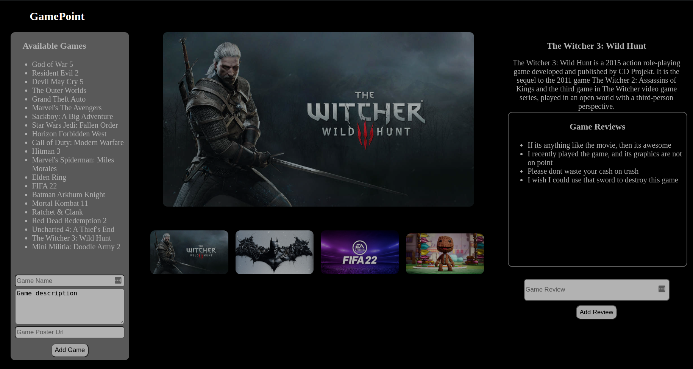
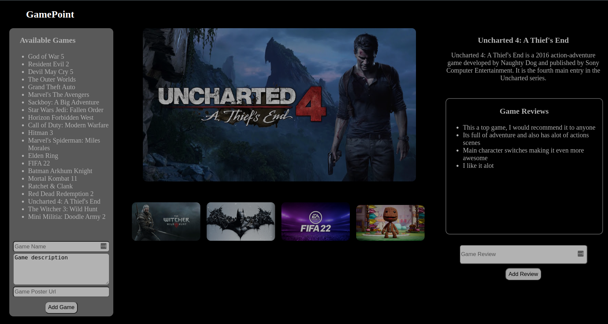
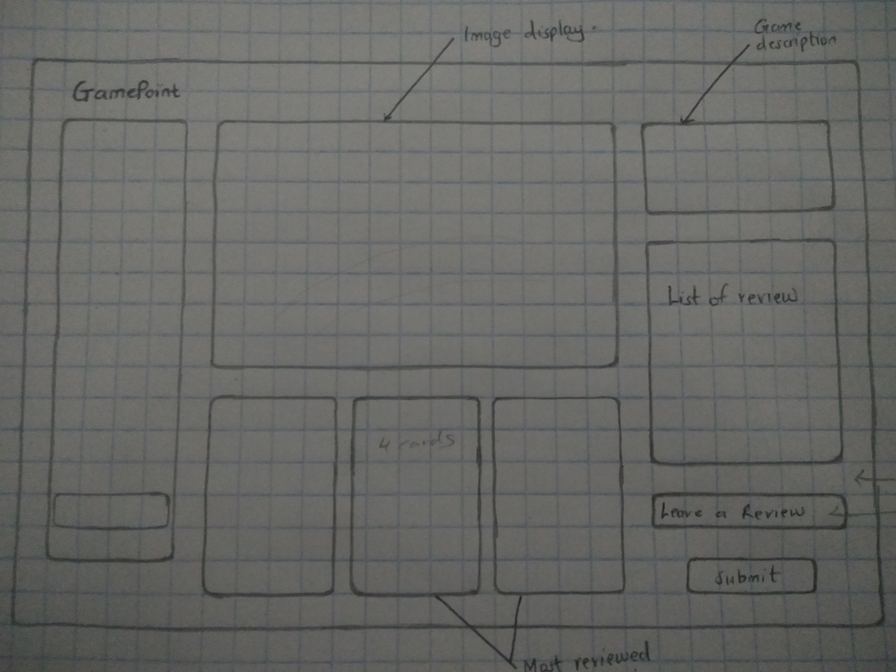

# GamePoint

#### Created by Omao Joash Machoka

## Description

GamePoint is a simple, single page website that can  be used by gamers to get more info on games through the reviews of other gamers.

## Screenshots

Notice the right section of the webpage which hosts the selected game name, description and its reviews which are all different for each game. It also hosts the review submission form.

## Link to the Website
[GamePoint](https://omaomach.github.io/GamePoint/)
I was unable to deploy my db.json file to heroku and integrate it with the deployed website, thus the lack of functionality. Please clone the project
and run it on your machine to see how it works.
As so as the db.json file is deployed, all the data will be avaible online as well.

## Setup Requirements
1. Visual Studio Code IDE
2. Chrome Web Browser
3. Git
4. Github (https://github.com/omaomach/GamePoint)
5. JS0N server(https://www.npmjs.com/package/json-server)
6. Node. js (https://nodejs.org/en/)
7. NPM (https://docs.npmjs.com/downloading-and-installing-node-js-and-npm)

## Development Server
The database for this project is run and supported by JSON server. Run json-server --watch db.json on the terminal to get the server running on port http://localhost:3000

## Languages used
* HTML
* CSS
* Javascript
* Markup

## Design Tools
The project being a single website, there were no design tools used. I created the design using pencil and paper.

## Known Bugs
The project has no known Bugs

## Support and Contact Details
In the case that the project becomes captivating to the user in that he/she may want to share ideas on how to improve it, please contact me using my github email:

* aaronjoash44@gmail.com

## License
This project has no license or any copyright. Its free for use by anyone as long the usage is legal.

